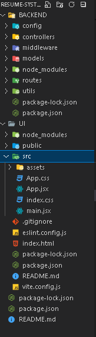

# Resume System – Dynamic Resume Builder

## Overview
**Resume System** is a next-generation Resume Building & Career Ecosystem designed for students and professionals. This platform will eventually allow users to automatically generate **dynamic, verified resumes** based on real achievements from internships, projects, courses, hackathons, and skills.

---

## Tech Stack
- **Frontend:** React.js  
- **Backend:** Node.js, Express.js  
- **Database:** MongoDB (Mongoose)  
- **Other Tools:** Axios, CORS, dotenv  

---

## Installation & Setup

### 1. Clone Repository
```bash
git clone https://github.com/ravitharun/resume-system.git
cd resume-system


## Backend Setup

To install dependencies and start the backend:

```bash
cd backend
npm install

## Frontend Setup

To install dependencies and start the Frontend:

```bash

cd UI
npm install

## Overall Setup Image




---

This version is **safe to push now**, shows your setup progress, and looks professional.  

If you want, I can also **write a 3–4 line “Trial Task Note”** to attach with this GitHub link for submission.  

Do you want me to do that?
